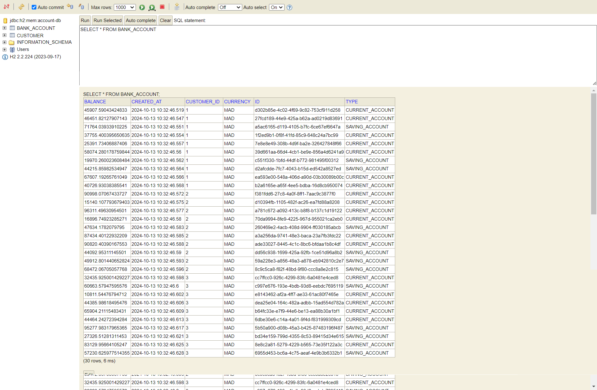
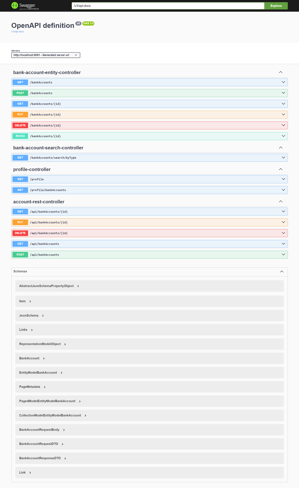
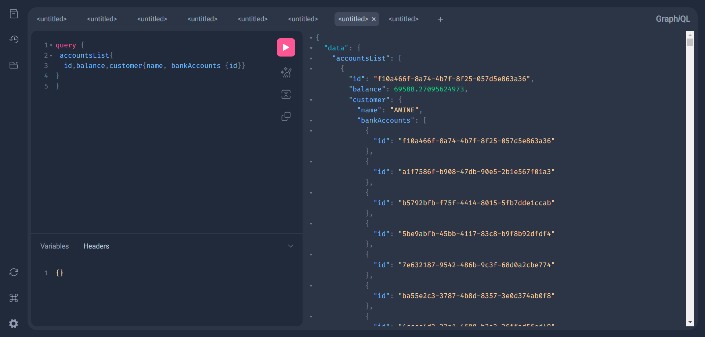
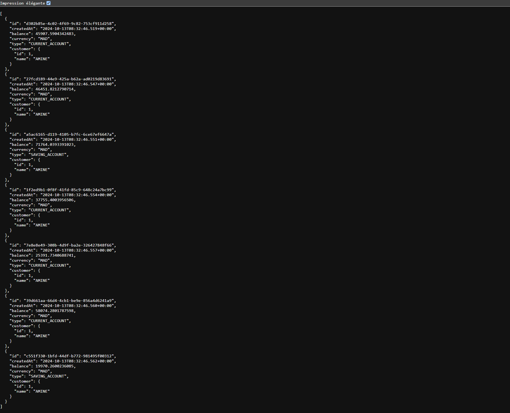

<h1>Activité Pratique N°1 - Développement d'un micro-service</h1>

<h2>H2 DataBase</h2>
<h3><b>Link : </b> http://localhost:8081/h2-console/login.do?jsessionid=00ddb5f3ab055484fdf5f5c2b8703a66</h3>

<h2>Rest API Doc</h2>
<h3><b>Link : </b> http://localhost:8081/swagger-ui/index.html#/</h3>

<h2>GraphQL Doc</h2>
<h3><b>Link : </b> http://localhost:8081/graphiql?path=/graphql</h3>

<h2>Test Api bankAccounts</h2>
<h3><b>Link : </b>http://localhost:8081/api/bankAccounts</h3>
